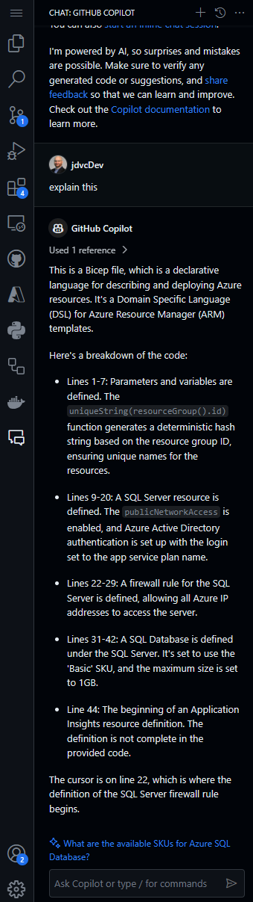
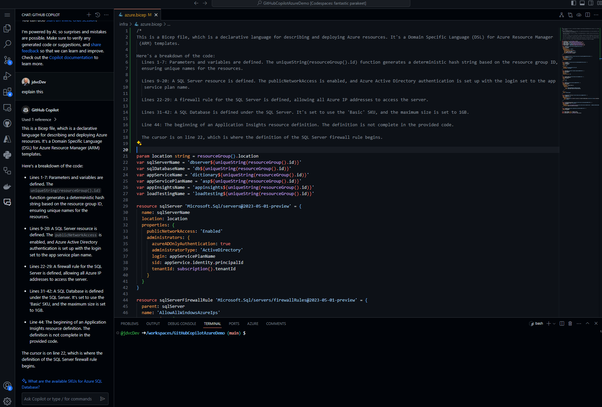
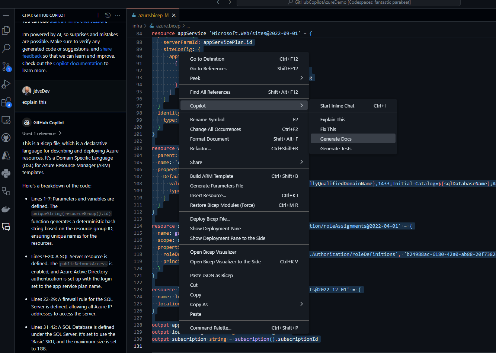
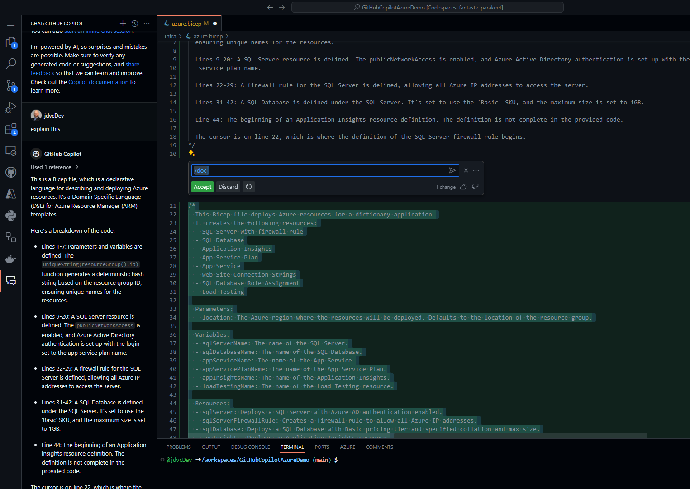
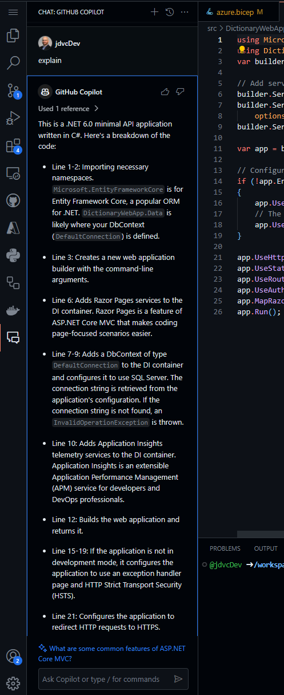
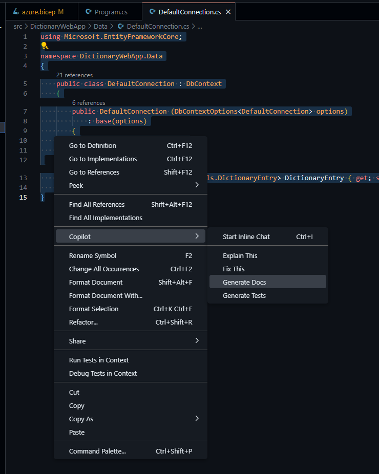
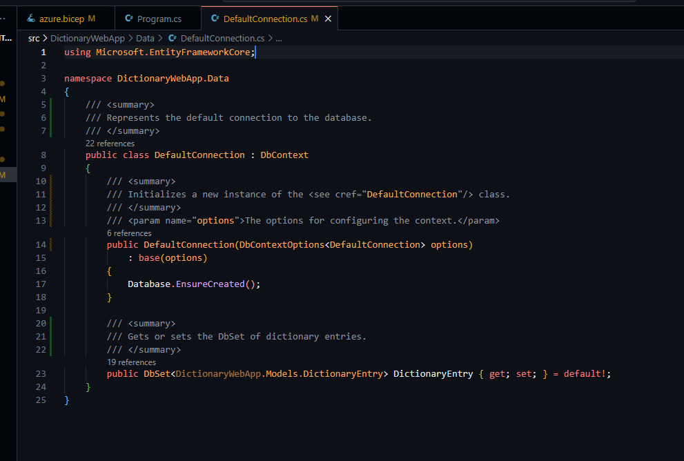
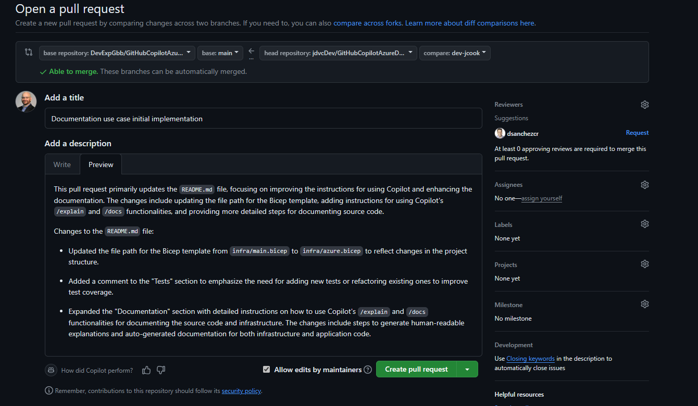

# Dictionary App - A GitHub Copilot & Azure Demo 
A sample CRUD application to showcase the power of GitHub Copilot and Azure better together covering different use cases to highlight how you can innovate your applications.

## Prerequisites

- [GitHub Account](https://github.com)
- [GitHub Copilot License](https://github.com/features/copilot)
- [Azure Subscription](https://azure.microsoft.com/en-us/free/) - If you have a [Visual Studio subscription](https://my.visualstudio.com) you can use your Azure credits.
- [Azure CLI](https://learn.microsoft.com/cli/azure/install-azure-cli)

## Getting Started

1. Create a new repository from this template by clicking on the [`Use this template`](https://github.com/new?template_name=DictionaryApp&template_owner=Azure-Samples) button at the top of the repository.
2. In the terminal or in Azure Cloud Shell, run the following command to login to your Azure subscription using the Azure CLI:
    ```bash
    az login
    az ad sp create-for-rbac --name "<name for your service principal>" --role owner --scopes /subscriptions/{subscription-id} --json-auth
    ```
    Copy the JSON output.
    > Note: To learn more about the GitHub Actions authentication with Azure, refer to the [GitHub Actions for Azure](https://learn.microsoft.com/azure/developer/github/connect-from-azure?tabs=azure-portal%2Cwindows#use-the-azure-login-action-with-a-service-principal-secret) documentation.
3. In your GitHub repository, go to `Settings` -> `Secrets and variables` -> `Actions` -> `New repository secret` and add the following secret:
    - `AZURE_CREDENTIALS` Paste the JSON from the previous step and save the secret.
4. Clone the repository to your local machine or use GitHub Codespaces. (If you want to use GitHub Copilot Enterprise, you do not need to clone the repository).
5. You are all set, follow the instructions in the [demo](#Demo) section to start.

You can use any of the following tools to run this demo:

- [GitHub Copilot Enterprise](https://github.com/github-copilot/enterprise_signup/choose_enterprise) - Use the Copilot from the UI.
- [GitHub Codespaces](https://github.com/codespaces/new?ref=main&skip_quickstart=true) - Use the Codespaces template from this repo.
- [Visual Studio Code](https://code.visualstudio.com) or [Visual Studio](https://visualstudio.microsoft.com) with the GitHub Copilot extensions installed:
    - [GitHub Copilot extension for VS Code](https://marketplace.visualstudio.com/items?itemName=GitHub.copilot)
    - [GitHub Copilot Chat for VS Code](https://marketplace.visualstudio.com/items?itemName=GitHub.copilot-chat)
  
## Repository Content

This repository contains the following content:

- [Dictionary App](./src/DictionaryWebApp/) - A simple .NET 8 Web App with CRUD operations to a SQL DB. (DockerFile added to support container deployment)
- [Dictionary Unit Tests](./src/DictionaryWebApp.UnitTests/) - Unit tests for the Dictionary App.
- [Dictionary Playwright Tests](./src/DictionaryWebApp.PlaywrightTests/) - End-to-end test for the Web App.
- [Infrastructure](./infra/) - Bicep templates to deploy the following Azure resources:
    - Azure App Service
    - SQL Azure Database
    - Azure Application Insights
    - Azure Load Testing
- [GitHub Actions](./.github/workflows/) - CI/CD workflow to build, test and deploy the web app.

## Demo

Let's suppose you are new developer in the team and you are tasked to improve the Dictionary App, so you need to understand how the app is built, tested and deployed. You need to identify how to make it better and more efficient by opening a pull request with your recommendations. 

> Note: Here you can create a new branch that you can add later to open a pull request with your changes.

There are many things you can do, take a look at the following scenarios:

#### **Infrastructure**:

Let's start by taking a look at what resources are getting deployed to Azure and what new resources you can add in your pull request.

- Use Copilot to understand what is getting deployed to Azure from the Bicep template.
    1. Open the `infra/azure.bicep` file.

    2. Use the following prompt to ask Copilot to explain the resources that are getting deployed:
        ```bash
        What resources are getting deployed in the Bicep template?
        ```
    3. You notice that although you have a SQL Azure DB and Azure App Service, the connection to the DB is through a role based access control (RBAC), if you or someone else in the team needs to add another secret like an API key or other token you will need a secure resource to store it. So you need to add a new Azure Key Vault and assign the "Key Vault Reader" role to the App Service.
        ```bash
        Add a new Azure Key Vault in the Bicep template and assign the "Key Vault Reader"  role to the App Service, the output should be the Key Vault URI and it should be stored in the App Service configuration.
        ```
        > Note: You will also need to add the Azure Key Vault support in the DictionaryWebApp project.

#### **Documentation**:

To begin documenting our source code, lets take a look at the `/explain` and `/docs` functionality in Copilot

- You can use the `/explain` functionality in Copilot to give you an overview of the current file you're looking at or the snippet of code that's highlighted. Lets start Bicep infrastructure code:
  1. Open the `infra/azure.bicep` file.

  2. Either right click and choose Copilot -> Explain This or open the Copilot chat blade and ask Copilot to explain this, as illustrated below:
  
    

    You can see the result output is a human language explanation of the file with a high level explanation of the functionality in the file.  It's common to take this output and prepend it to the file for context.

    


- Secondly you can use the `/docs' feature to auto generate documentation for you code.

  1. In the same file, `infra/azure.bicep` highlight all of the source code, right click and choose Copilot -> Generate Docs as show below:

    

    The result is a set of documentation explaining the resources created, parameters and variables used.

  2. Choose accept to to insert the generated documentation into the beginning of the file as shown:

    

- Lets take a look at the same Copilot functionality used with the main application code.

    1. Begin by navigating to the file `src/DictionaryWebApp/Program.cs`.  Again as we did before, using the Copilot chat interface, ask Copilot to Explain:

    

    The result is again human readable explanation of the code.

    2. Lets now navigate to `src/DictionaryWebApp/Data/DefaultConnection.cs` for some variability in the code contents.

    3. Again as before right click and choose Copilot -> Generate Docs.

    

    as shown below the result is annotation documentation in our code.

    

- Extra credit

    1. Use the Copilot PR summary feature to summarize your PR.

    